# INNA AI Engineering Portfolio

[](https://github.com/Rogerio5/INNA-AI-Engineering-Portfolio/actions/workflows/ci.yml)

> Portfólio público de **Engenharia de Inteligência Artificial** aplicado a um domínio demonstrativo de educação financeira.

O **INNA AI Engineering Portfolio** reúne implementações práticas de **LangGraph, sistemas multiagentes, Agentic RAG, Hybrid RAG, Tool Calling, Context Engineering, memória, Human-in-the-Loop, GraphRAG, avaliação, observabilidade e resiliência** em uma arquitetura Python modular.

> **Importante:** este repositório é um portfólio técnico.  
> Ele não contém a lógica comercial completa da plataforma **Sabino.AI**, dados reais de clientes, credenciais privadas ou regras proprietárias completas do produto financeiro.

---

# 🎯 Objetivo

Demonstrar práticas de **Engenharia de IA** aplicadas à construção de sistemas com LLMs e agentes inteligentes.

O projeto explora:

- arquiteturas multiagentes;
- orquestração com LangGraph;
- Agentic RAG;
- Hybrid RAG;
- Tool Calling;
- memória;
- Context Engineering;
- governança de agentes;
- Human-in-the-Loop;
- GraphRAG;
- integração com LLMs;
- avaliação de sistemas de IA;
- observabilidade;
- resiliência;
- testes automatizados;
- Quality Gates;
- CI/CD.

O domínio financeiro é utilizado exclusivamente como **cenário educacional e demonstrativo**.

---

# 🧠 Visão geral

| Área | Implementação |
|---|---|
| Orquestração | LangGraph, Supervisor, Routing e Handoffs |
| Agentes | Agent Registry e arquitetura Multi-Agent |
| Tool Calling | Tool Registry, contratos e permissões |
| Context Engineering | Seleção de contexto, privacidade e Token Budget |
| Memória | Conversation Memory, Summaries e Checkpoints |
| RAG | Hybrid RAG e estratégias avançadas de retrieval |
| Agentic RAG | Planner, Research Agent, Collector e Synthesizer |
| GraphRAG | Knowledge Graph e Neo4j |
| LLM | Google Gemini / Google GenAI |
| Governança | Human-in-the-Loop e Execution Governance |
| Integrações | MCP e A2A |
| Avaliação | RAG Triad, DeepEval e bridges de avaliação |
| Observabilidade | OpenTelemetry e Phoenix |
| Resiliência | Circuit Breaker, Retry, Backoff e Deadlines |
| Qualidade | Pytest, GitHub Actions e Quality Gates |

---

# 🏗️ Arquitetura

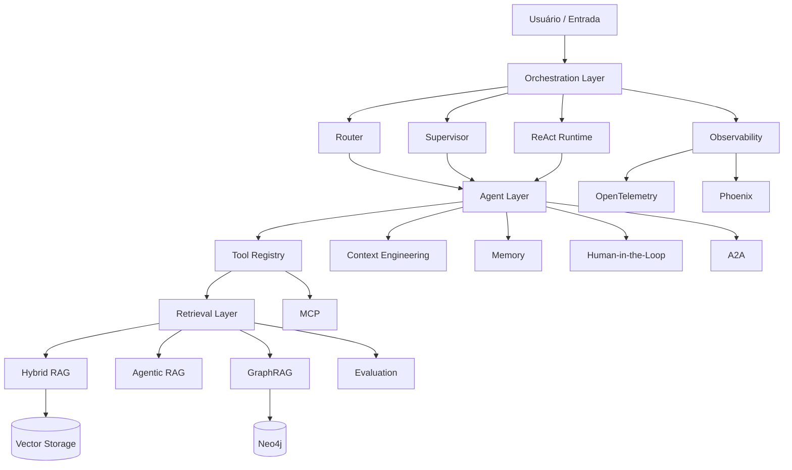

---

# 🔄 Fluxo de execução

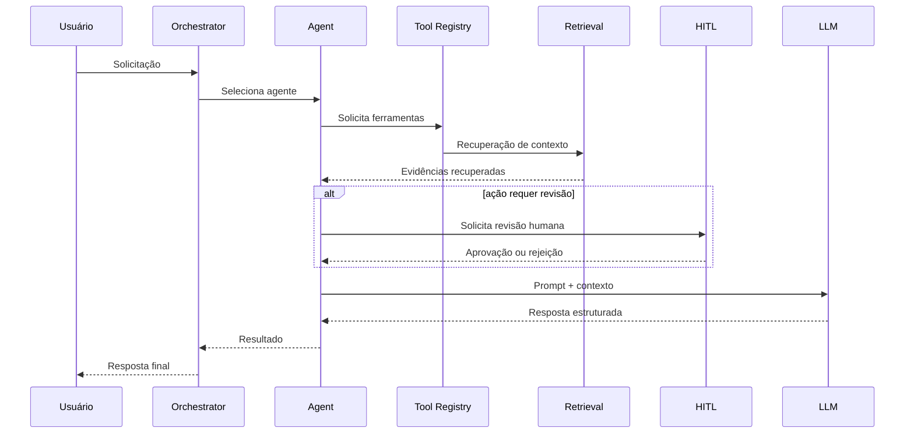

---

# 🤖 Arquitetura Multiagente

O projeto utiliza uma arquitetura composta por agentes especializados.

Entre os componentes estão:

- **Agent Registry**
- **Supervisor**
- **Routing**
- **Handoffs**
- **Task Completion**
- **Research Agent**
- **Financial Education Agent**
- **RAG Agent**
- **Fallback Agent**

A comunicação e as permissões entre agentes e ferramentas são controladas por contratos explícitos.

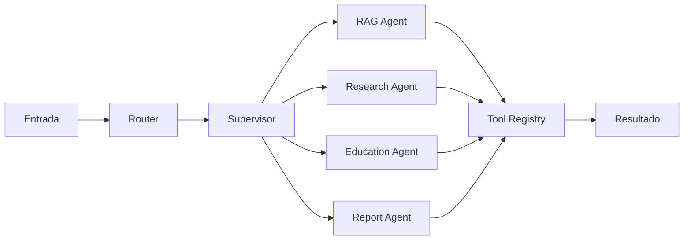

---

# 🔎 Agentic RAG

O módulo de **Agentic RAG** adiciona planejamento e decomposição de pesquisas ao processo tradicional de recuperação.

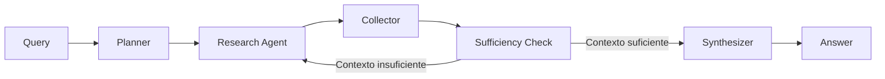

## Componentes

| Componente | Responsabilidade |
|---|---|
| Planner | decompor a consulta |
| Router | selecionar estratégia |
| Research Agent | executar pesquisa |
| Collector | consolidar evidências |
| Sufficiency | verificar suficiência |
| Synthesizer | gerar resposta consolidada |

---

# 📚 Hybrid RAG

A camada de recuperação possui componentes voltados para estratégias avançadas de RAG.

Entre eles:

- Hybrid Retrieval;
- Sentence Window Retrieval;
- Auto-Merging Retrieval;
- Retrieval Tracing;
- Reranking;
- Grounding;
- embeddings;
- armazenamento vetorial.

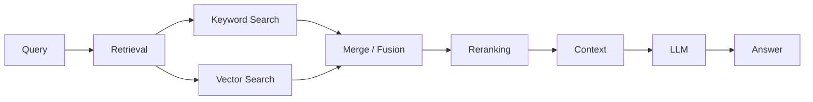

---

# 🕸️ GraphRAG

O projeto possui uma camada de **Knowledge Graph / GraphRAG** preparada para Neo4j.

Ela permite representar relações entre:

- documentos;
- chunks;
- conceitos;
- tópicos;
- fontes.

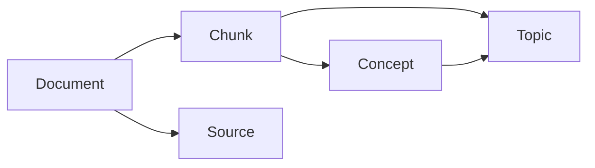

---

# 🧩 Tool Calling

O projeto implementa um **Tool Registry** responsável por controlar ferramentas disponíveis aos agentes.

Uma ferramenta pode possuir:

- schema de entrada;
- schema de saída;
- handler;
- timeout;
- agentes autorizados;
- propriedades de segurança;
- metadados;
- regras de execução.

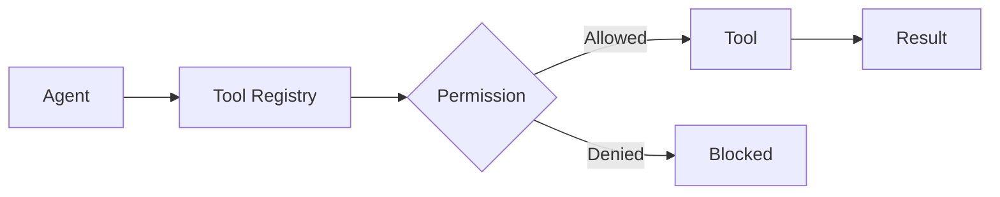

---

# 🧠 Context Engineering

A camada de Context Engineering controla quais informações devem chegar ao LLM.

Entre os componentes estão:

- Context Builder;
- History Selector;
- Privacy Filter;
- Token Budget;
- Tool Selector;
- schemas estruturados.

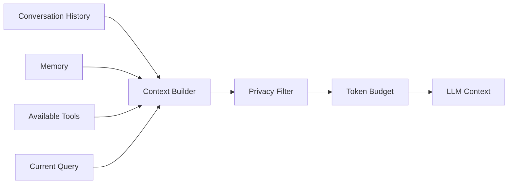

---

# 💾 Memória

A arquitetura possui componentes para gerenciamento de contexto persistente e memória conversacional.

Inclui:

- conversation summaries;
- checkpoints;
- memory extraction;
- history selection;
- integração com fluxos LangGraph.

---

# 👤 Human-in-the-Loop

O módulo **Human-in-the-Loop (HITL)** permite interromper fluxos para revisão humana.

A revisão pode ser utilizada quando houver:

- risco elevado;
- baixa confiança;
- inconsistências;
- dados obrigatórios ausentes;
- ações externas;
- necessidade de aprovação explícita.

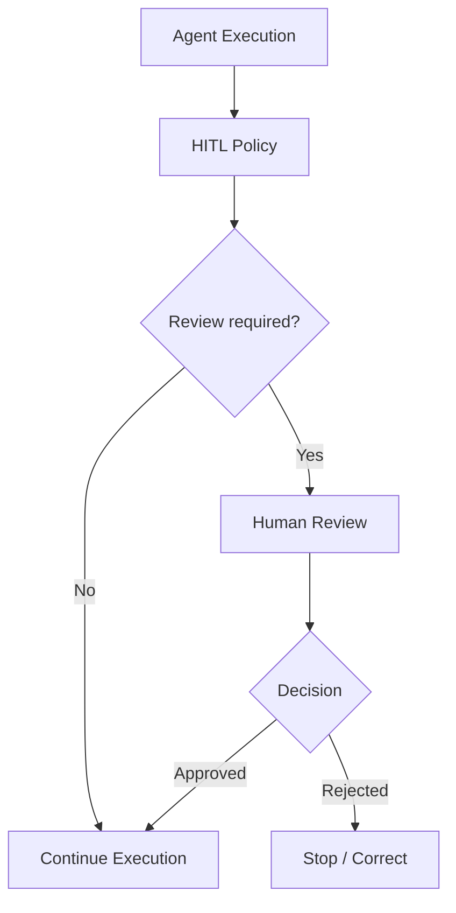

---

# 🔌 MCP e A2A

O projeto possui integrações para comunicação e interoperabilidade entre agentes e ferramentas.

## MCP

O módulo MCP implementa:

- manifesto de ferramentas;
- segurança;
- auditoria;
- exposição controlada de tools.

## A2A

A camada A2A fornece contratos para comunicação **Agent-to-Agent**.

---

# 📊 Observabilidade

O projeto possui suporte para observabilidade de aplicações de IA.

Tecnologias utilizadas:

- OpenTelemetry;
- Phoenix;
- tracing;
- métricas de LLM;
- acompanhamento de custos;
- eventos de execução.

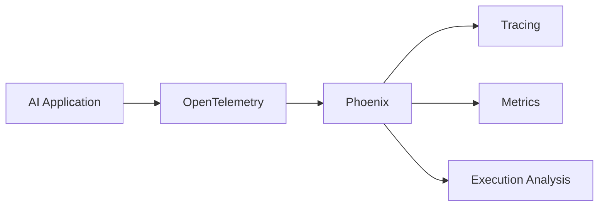

---

# 🛡️ Resiliência

O projeto aplica padrões de Engenharia de Software a sistemas de IA.

| Componente | Objetivo |
|---|---|
| Circuit Breaker | evitar chamadas repetidas para serviços indisponíveis |
| Retry | repetir operações transitórias |
| Exponential Backoff | controlar intervalo entre tentativas |
| Deadline | limitar tempo de execução |
| Failure Classification | classificar tipos de falha |
| Fallback | fornecer caminhos alternativos |
| Tracing | acompanhar eventos de resiliência |

---

# 🧪 Avaliação de sistemas de IA

A camada `evaluation` contém componentes para avaliação de sistemas RAG e LLM.

Inclui suporte a:

- RAG Triad;
- avaliação de contexto;
- groundedness;
- relevância;
- qualidade da resposta;
- DeepEval;
- bridges opcionais para frameworks adicionais.

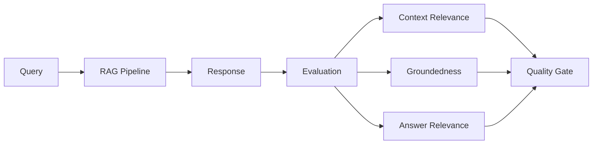

---

# ✅ Quality Gates

O projeto utiliza validações automáticas para garantir a integridade do código.

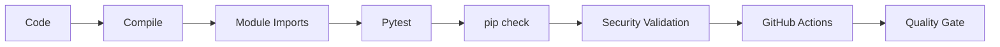

O CI é executado automaticamente em:

- pushes na branch `main`;
- pull requests direcionados para `main`.

---

# ⚙️ GitHub Actions

O pipeline de CI realiza:

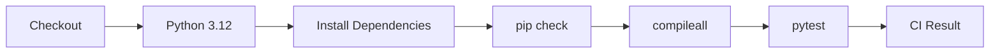

Status atual:

[](https://github.com/Rogerio5/INNA-AI-Engineering-Portfolio/actions/workflows/ci.yml)

---

# 🛠️ Stack tecnológica

| Categoria | Tecnologias |
|---|---|
| Linguagem | Python |
| LLM | Google Gemini / Google GenAI |
| Agentes | LangGraph |
| Agentic RAG | LangGraph + LlamaIndex |
| Retrieval | Hybrid Search, Reranking |
| Knowledge Graph | Neo4j |
| Persistência | PostgreSQL |
| Schemas | Pydantic |
| Agent Communication | MCP / A2A |
| Observabilidade | OpenTelemetry, Phoenix |
| Avaliação | DeepEval, RAG Triad |
| Testes | Pytest |
| CI/CD | GitHub Actions |

---

# 📁 Estrutura do projeto

```text
src/inna_ai/
├── agents/
│   ├── registry/
│   ├── routing/
│   └── supervision/
│
├── context/
│
├── demo/
│   └── financial_education/
│
├── evaluation/
│
├── governance/
│   ├── blackboard/
│   └── hitl/
│
├── integrations/
│   ├── a2a/
│   └── mcp/
│
├── llm/
│
├── memory/
│
├── observability/
│
├── orchestration/
│
├── persistence/
│
├── resilience/
│
├── retrieval/
│   ├── agentic/
│   ├── embeddings/
│   ├── graph/
│   ├── hybrid/
│   └── storage/
│
└── tools/
```

---

# 🔐 Fronteira pública

Este repositório foi separado deliberadamente do produto comercial.

| Incluído no portfólio | Não incluído |
|---|---|
| Arquitetura de IA | Dados reais de clientes |
| LangGraph | Billing |
| Multiagentes | Planos comerciais |
| Agentic RAG | Assinaturas |
| Hybrid RAG | Administração de clientes |
| GraphRAG | Credenciais |
| HITL | Integrações comerciais privadas |
| Tool Calling | Regras financeiras proprietárias completas |
| Observabilidade | Backend comercial da Sabino.AI |
| Avaliação | Dados internos |
| Adapters demonstrativos | Infraestrutura privada |

Mais detalhes:

- [Arquitetura](docs/ARCHITECTURE.md)
- [Public Boundary](docs/PUBLIC_BOUNDARY.md)
- [Security](SECURITY.md)

---

# 🎓 Bootcamp 2026 — Engenharia de IA aplicada na prática

Este portfólio também documenta a aplicação prática dos conteúdos estudados no **Bootcamp 2026 — Engenharia de IA**.

A proposta desta trilha não é apenas registrar tecnologias estudadas, mas demonstrar como os conceitos foram transformados em arquitetura, implementação, código, testes e evidências técnicas.

> **Trilha de evidências:**  
> conteúdo estudado → arquitetura → implementação → código → testes → avaliação → validação técnica

## 🗂️ Evolução por semana

| Semana | Tema | Aplicação no portfólio |
|---|---|---|
| **Semana 1** | Agentes e fundamentos | LangGraph, agentes especializados, Tool Use, Context Engineering, Structured Outputs e Gemini |
| **Semana 2** | Multiagentes e produção | Supervisor, Routing, Handoffs, Checkpoints, Human-in-the-Loop, Phoenix e OpenTelemetry |
| **Semana 3** | RAG e Retrieval Avançado | Hybrid RAG, RRF, Reranking, Sentence Window, Auto-Merging, Knowledge Graph, GraphRAG e Neo4j |
| **Semana 4** | Agentic RAG e avaliação | Planner, Research Agent, Tool Calling, LlamaIndex, RAG Triad, DeepEval e Quality Gates |

---

## 🤖 Semana 1 — Agentes e fundamentos

Principais conceitos trabalhados:

- fundamentos de agentes;
- LangGraph;
- ferramentas;
- Context Engineering;
- saídas estruturadas;
- integração com modelos de linguagem.

Aplicações presentes no portfólio:

- agentes especializados;
- Agent Registry;
- roteamento;
- estado estruturado;
- Tool Calling;
- Context Engineering;
- Google Gemini.

Documentação:

- [Semana 1 — README](docs/bootcamp-2026/semana-01/README.md)
- [Evidências da Semana 1](docs/bootcamp-2026/semana-01/evidencias/README.md)

---

## 🧠 Semana 2 — Multiagentes e produção

Principais conceitos trabalhados:

- arquiteturas multiagentes;
- supervisão;
- handoffs;
- persistência de estado;
- checkpoints;
- Human-in-the-Loop;
- tracing;
- observabilidade;
- avaliação de agentes.

Aplicações presentes no portfólio:

- Supervisor;
- Team Routing;
- Handoff Coordinator;
- checkpoints;
- memória;
- Human-in-the-Loop;
- OpenTelemetry;
- Phoenix.

Documentação:

- [Semana 2 — README](docs/bootcamp-2026/semana-02/README.md)
- [Evidências da Semana 2](docs/bootcamp-2026/semana-02/evidencias/README.md)

---

## 🔎 Semana 3 — RAG e Retrieval Avançado

A Semana 3 aprofunda a arquitetura RAG, com foco em qualidade de retrieval, redução de contexto desnecessário e avaliação.

Principais conceitos:

- RAG;
- chunking;
- embeddings;
- busca textual;
- busca vetorial;
- Hybrid Retrieval;
- Reciprocal Rank Fusion — RRF;
- reranking;
- grounding;
- Sentence Window Retrieval;
- Auto-Merging Retrieval;
- RAG Triad;
- Knowledge Graph;
- Neo4j;
- Graph Retrieval;
- GraphRAG.

Aplicações presentes no portfólio:

```text
Consulta
   ↓
Hybrid Retrieval
   ↓
Fusion / Reranking
   ↓
Context Engineering
   ↓
LLM
   ↓
Evaluation
```

Documentação:

- [Semana 3 — README](docs/bootcamp-2026/semana-03/README.md)
- [Fundamentos de RAG](docs/bootcamp-2026/semana-03/evidencias/01-fundamentos-rag.md)
- [Chunking, Embeddings e Hybrid Search](docs/bootcamp-2026/semana-03/evidencias/02-chunking-embeddings-hybrid-search.md)
- [RRF, Reranking e Grounding](docs/bootcamp-2026/semana-03/evidencias/03-rrf-reranking-grounding.md)
- [Sentence Window Retrieval](docs/bootcamp-2026/semana-03/evidencias/04-sentence-window-retrieval.md)
- [Auto-Merging Retrieval](docs/bootcamp-2026/semana-03/evidencias/05-auto-merging-retrieval.md)
- [RAG Triad e DeepEval](docs/bootcamp-2026/semana-03/evidencias/06-rag-triad-e-deepeval.md)
- [Knowledge Graphs e GraphRAG](docs/bootcamp-2026/semana-03/evidencias/07-knowledge-graphs-e-graphrag.md)

---

## 🧭 Semana 4 — Agentic RAG e avaliação

A Semana 4 conecta agentes, ferramentas, RAG e avaliação.

Principais conceitos:

- Agentic RAG;
- Router Agents;
- Research Agents;
- Tool Calling;
- pesquisa multi-documento;
- LlamaIndex AgentWorkflow;
- RAG Triad;
- RAGAS;
- DeepEval;
- TruLens;
- Quality Gates;
- avaliação automatizada;
- CI/CD aplicado à avaliação de IA.

Fluxo conceitual:

```text
Pergunta
   ↓
Router / Orchestration
   ↓
Research Agent
   ↓
Retrieval
   ↓
Evidências
   ↓
Evaluation
   ↓
Resposta fundamentada
```

Documentação:

- [Semana 4 — README](docs/bootcamp-2026/semana-04/README.md)
- [Agentic RAG](docs/bootcamp-2026/semana-04/evidencias/01-agentic-rag.md)
- [Router Agents e Tool Calling](docs/bootcamp-2026/semana-04/evidencias/02-router-agents-e-tool-calling.md)
- [Pesquisa Multi-documento](docs/bootcamp-2026/semana-04/evidencias/03-pesquisa-multidocumento.md)
- [RAG Triad](docs/bootcamp-2026/semana-04/evidencias/04-rag-triad.md)
- [RAGAS](docs/bootcamp-2026/semana-04/evidencias/05-ragas.md)
- [DeepEval e Quality Gates](docs/bootcamp-2026/semana-04/evidencias/06-deepeval-quality-gates.md)
- [TruLens e Observabilidade](docs/bootcamp-2026/semana-04/evidencias/07-trulens-e-observabilidade.md)
- [CI/CD e Avaliação](docs/bootcamp-2026/semana-04/evidencias/08-ci-cd-e-avaliacao.md)
- [Aplicação na INNA](docs/bootcamp-2026/semana-04/evidencias/09-aplicacao-na-inna.md)
- [LlamaIndex e otimização](docs/bootcamp-2026/semana-04/evidencias/10-llamaindex-producao-e-otimizacao.md)

---

## 🔬 Trilha de evidências

A organização do portfólio busca conectar estudo e implementação de forma rastreável.

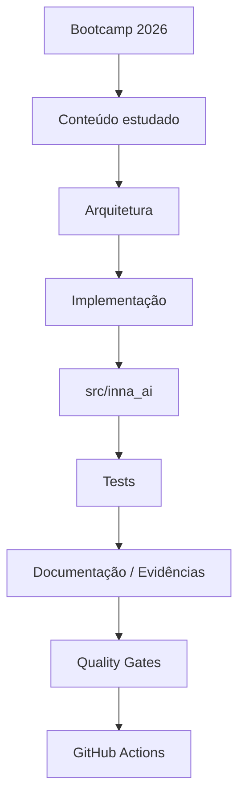

As evidências do Bootcamp funcionam como um índice para os componentes reais do projeto.

Principais áreas:

```text
README
   ↓
docs/bootcamp-2026/
   ↓
Semana
   ↓
Competência
   ↓
src/inna_ai/
   ↓
tests/
   ↓
Quality Gates
   ↓
CI
```

Documentação principal:

- [Bootcamp 2026](docs/bootcamp-2026/README.md)
- [Semana 1](docs/bootcamp-2026/semana-01/README.md)
- [Semana 2](docs/bootcamp-2026/semana-02/README.md)
- [Semana 3](docs/bootcamp-2026/semana-03/README.md)
- [Semana 4](docs/bootcamp-2026/semana-04/README.md)

---

# 📦 Instalação

## Windows / PowerShell

Crie o ambiente virtual:

```powershell
py -3.12 -m venv .venv
```

Ative:

```powershell
.\.venv\Scripts\Activate.ps1
```

Atualize o pip:

```powershell
python -m pip install --upgrade pip
```

Instale as dependências:

```powershell
python -m pip install -r requirements/runtime.txt
python -m pip install -r requirements/dev.txt
```

Instale o projeto:

```powershell
python -m pip install -e .
```

---

# 🔑 Configuração

Crie seu arquivo local de ambiente:

```powershell
Copy-Item .env.example .env
```

> Nunca publique o arquivo `.env`.

As integrações externas devem receber credenciais exclusivamente através de variáveis de ambiente.

---

# 🧪 Testes

Execute:

```powershell
python -m pytest tests -q
```

A suíte estrutural foi projetada para funcionar sem exigir serviços externos reais como:

- Gemini;
- PostgreSQL;
- Neo4j;
- Phoenix remoto.

---

# 📚 Documentação

A pasta `docs/` contém documentação técnica relacionada a:

- arquitetura multiagente;
- LangGraph;
- Context Engineering;
- Hybrid RAG;
- Agentic RAG;
- Tool Calling;
- Human-in-the-Loop;
- GraphRAG;
- LlamaIndex;
- avaliação;
- observabilidade;
- Quality Gates;
- estudos e implementações do Bootcamp 2026.

Principais documentos:

- [Architecture](docs/ARCHITECTURE.md)
- [Public Boundary](docs/PUBLIC_BOUNDARY.md)
- [Security](SECURITY.md)
- [Bootcamp 2026](docs/bootcamp-2026/README.md)

---

# 🔒 Segurança

Nenhuma chave ou credencial é necessária para executar os testes estruturais offline.

Boas práticas utilizadas no projeto:

- variáveis de ambiente;
- `.env` ignorado pelo Git;
- `.env.example`;
- filtros de privacidade;
- separação entre código público e produto comercial;
- validações antes da publicação;
- permissões explícitas de ferramentas;
- Human-in-the-Loop;
- Quality Gates.

Consulte:

[SECURITY.md](SECURITY.md)

---

# 📜 Uso do código

Este repositório é disponibilizado publicamente como **portfólio técnico e material para avaliação profissional**.

Ele **não é distribuído sob uma licença open source**.

A ausência de uma licença explícita significa que este repositório não concede automaticamente autorização ampla para reutilização, redistribuição ou incorporação substancial do código em outros projetos.

---

# 💰 Aviso financeiro

Os recursos financeiros deste repositório existem exclusivamente para fins educacionais e demonstração técnica de Engenharia de IA.

Eles **não constituem recomendação financeira, recomendação de crédito ou recomendação de investimento**.

---

# 🔗 Relação com INNA Financial Coach AI

Este portfólio foi estruturado a partir de componentes de Engenharia de IA desenvolvidos durante a evolução da **INNA Financial Coach AI**.

O objetivo deste repositório é apresentar esses componentes de forma separada, organizada e adequada para avaliação técnica.

Projeto relacionado:

**[INNA Financial Coach AI](https://github.com/Rogerio5/INNA-Financial-Coach-AI)**

Enquanto a **INNA Financial Coach AI** apresenta a evolução de uma plataforma aplicada ao domínio financeiro, o **INNA AI Engineering Portfolio** concentra-se especificamente nas práticas e arquiteturas de Engenharia de IA.

---

# 👨‍💻 Autor

## Rogério Augusto Sabino

**Engenharia de IA & Dados**

GenAI • RAG • LLMs • Agentic AI • Python • Machine Learning • MLOps

GitHub:

[github.com/Rogerio5](https://github.com/Rogerio5)

---

# ⭐ Sobre este projeto

Este repositório representa a evolução prática dos meus estudos e projetos em **Engenharia de Inteligência Artificial**.

Ele reúne conceitos de:

- Software Engineering;
- Generative AI;
- Machine Learning;
- Agentic AI;
- Multi-Agent Systems;
- RAG;
- LLM Applications;
- Context Engineering;
- AI Governance;
- MLOps;
- Observability;
- AI Evaluation.

O objetivo é demonstrar não apenas chamadas para modelos de linguagem, mas a construção de **sistemas de IA estruturados, governados, testáveis, observáveis e resilientes**.
