# INNA AI Engineering Portfolio

[](https://github.com/Rogerio5/INNA-AI-Engineering-Portfolio/actions/workflows/ci.yml)

> Portfólio público de **Engenharia de Inteligência Artificial**, com foco em sistemas baseados em LLMs, agentes, RAG, governança, avaliação e observabilidade.

O **INNA AI Engineering Portfolio** reúne implementações e estudos práticos de:

**LangGraph • Multi-Agent Systems • Agentic RAG • Hybrid RAG • GraphRAG • Tool Calling • Context Engineering • Memory • Human-in-the-Loop • LlamaIndex • MCP • A2A • AI Evaluation • OpenTelemetry • Phoenix • Quality Gates • CI/CD**

O domínio de educação financeira é utilizado como **cenário demonstrativo** para apresentar componentes de Engenharia de IA de forma modular.

> **Importante**
>
> Este repositório é um portfólio técnico.
>
> Ele não contém a lógica comercial completa da **Sabino.AI**, dados reais de clientes, credenciais privadas, billing, assinaturas ou regras proprietárias completas do produto financeiro.

---

# 📑 Visão rápida

| Área | Implementação / abordagem |
|---|---|
| Orquestração | LangGraph, Supervisor, Routing e Handoffs |
| Agentes | Agent Registry e arquitetura Multi-Agent |
| Tool Calling | Tool Registry, contratos e permissões |
| Context Engineering | Context Builder, Privacy Filter e Token Budget |
| Memória | Summaries, History Selection e Checkpoints |
| Hybrid RAG | Keyword + Vector Retrieval, Fusion e Reranking |
| Agentic RAG | Planner, Research Agent, Collector e Synthesizer |
| GraphRAG | Knowledge Graph e integração com Neo4j |
| LLM | Google Gemini / Google GenAI |
| Governança | Human-in-the-Loop e Execution Governance |
| Integrações | MCP e A2A |
| Avaliação | RAG Triad, DeepEval e bridges de avaliação |
| Observabilidade | OpenTelemetry e Phoenix |
| Resiliência | Retry, Backoff, Circuit Breaker, Deadline e Fallback |
| Qualidade | Pytest, Quality Gates e GitHub Actions |

---

# 🎯 Objetivo

O objetivo deste repositório é demonstrar práticas de **Engenharia de IA aplicadas à construção de sistemas modernos com LLMs e agentes inteligentes**.

Mais do que executar chamadas simples para um modelo de linguagem, o projeto explora a construção de sistemas com:

- orquestração;
- especialização de agentes;
- recuperação de conhecimento;
- contexto;
- memória;
- ferramentas;
- governança;
- avaliação;
- observabilidade;
- tolerância a falhas;
- testes;
- automação de qualidade.

O resultado é uma arquitetura organizada para tornar aplicações de IA mais **estruturadas, testáveis, observáveis e governáveis**.

---

# 🏗️ Arquitetura

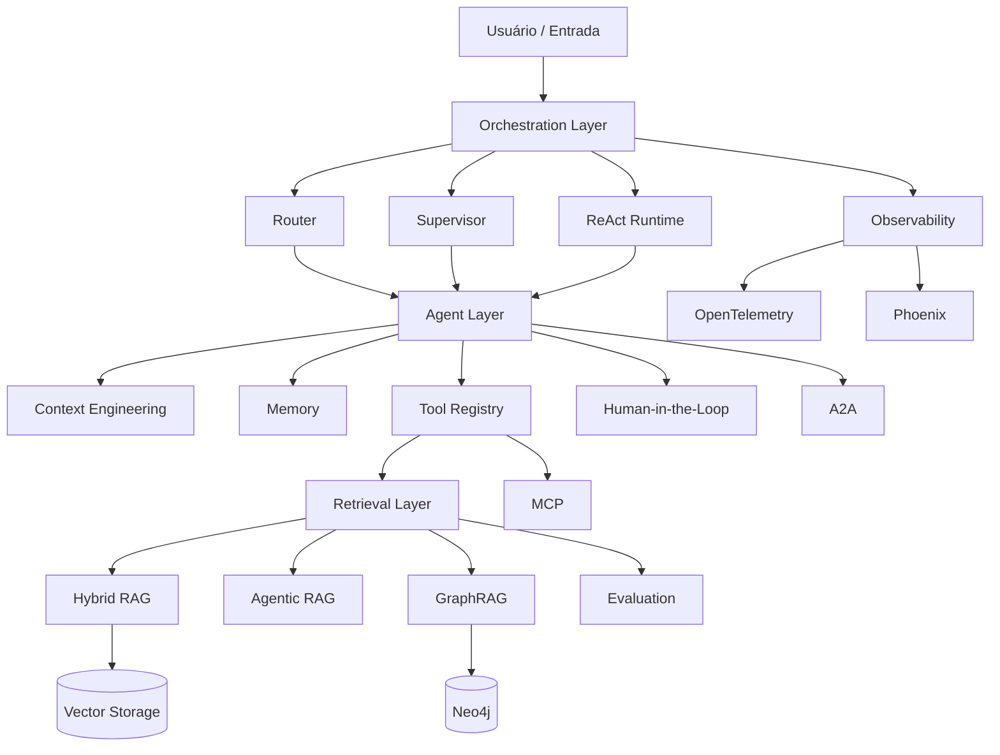

---

# 🔄 Fluxo de execução

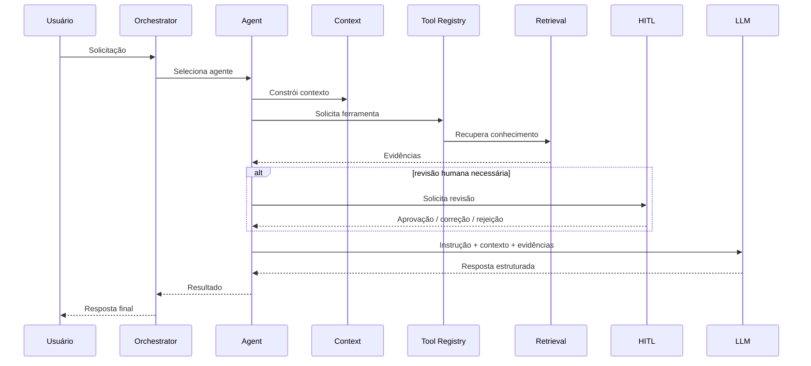

---

# 🤖 Arquitetura Multiagente

O projeto utiliza agentes especializados, coordenados por mecanismos explícitos de roteamento e supervisão.

Entre os componentes estão:

- Agent Registry;
- Supervisor;
- Router;
- Handoffs;
- Task Completion;
- Research Agent;
- RAG Agent;
- Financial Education Agent;
- Fallback Agent.

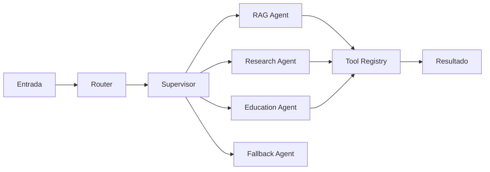

A comunicação entre agentes e ferramentas é controlada por contratos explícitos, evitando que qualquer agente tenha acesso irrestrito a todas as capacidades do sistema.

---

# 🔎 Agentic RAG

O **Agentic RAG** adiciona planejamento e tomada de decisão ao processo de recuperação.

Em vez de executar somente uma busca seguida de geração, o fluxo pode:

1. analisar a solicitação;
2. decompor a pesquisa;
3. selecionar ferramentas;
4. recuperar evidências;
5. verificar suficiência;
6. realizar novas buscas quando necessário;
7. sintetizar a resposta.

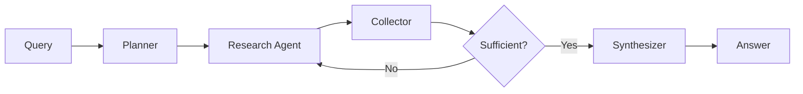

## Componentes

| Componente | Responsabilidade |
|---|---|
| Planner | decompor a solicitação |
| Router | escolher a estratégia |
| Research Agent | executar pesquisas |
| Collector | consolidar evidências |
| Sufficiency Check | verificar se o contexto é suficiente |
| Synthesizer | produzir a resposta consolidada |

---

# 📚 Hybrid RAG

A camada de recuperação combina diferentes estratégias para melhorar a construção de contexto.

Entre os componentes representados no projeto estão:

- Keyword / Text Retrieval;
- Vector Retrieval;
- embeddings;
- Fusion / RRF;
- reranking;
- grounding;
- Sentence Window Retrieval;
- Auto-Merging Retrieval;
- Retrieval Tracing;
- armazenamento vetorial.

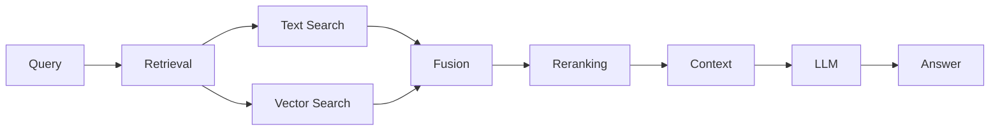

---

# 🕸️ Knowledge Graph e GraphRAG

O projeto possui componentes voltados à representação e recuperação de relações através de grafos.

A camada de Knowledge Graph permite trabalhar com relações entre:

- documentos;
- chunks;
- conceitos;
- tópicos;
- fontes.

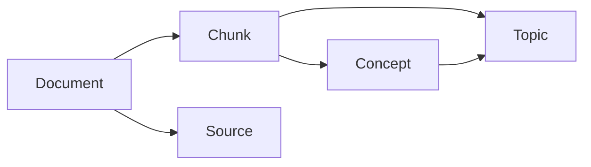

Uma estratégia de recuperação pode combinar diferentes fontes:

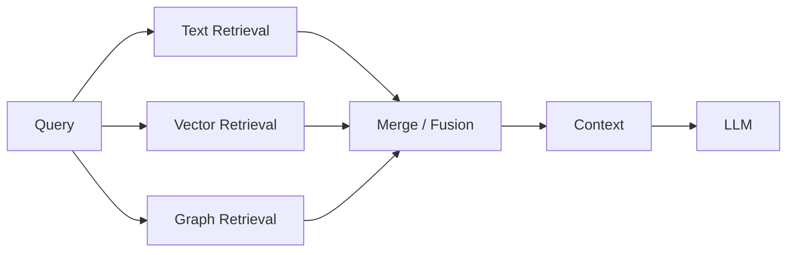

---

# 🧩 Tool Calling

O **Tool Registry** centraliza a definição e o controle das ferramentas disponíveis para os agentes.

Uma ferramenta pode possuir:

- schema de entrada;
- schema de saída;
- handler;
- timeout;
- lista de agentes autorizados;
- propriedades de segurança;
- metadados;
- regras de execução.

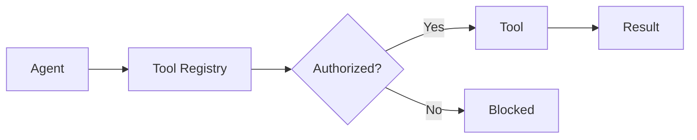

---

# 🧠 Context Engineering

O Context Engineering controla **o que efetivamente chega ao modelo de linguagem**.

A camada considera elementos como:

- mensagem atual;
- histórico;
- memória;
- ferramentas disponíveis;
- privacidade;
- limite de tokens;
- schemas estruturados.

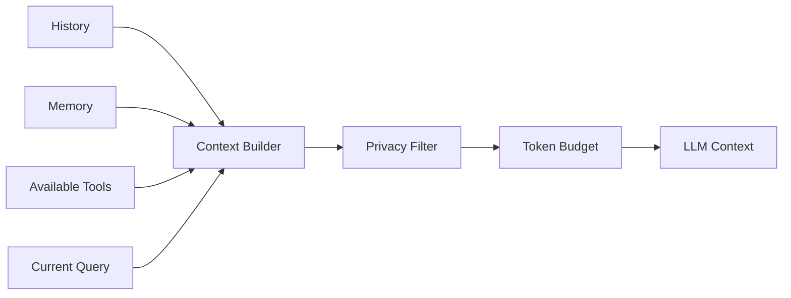

---

# 💾 Memória

A arquitetura possui componentes de gerenciamento de contexto persistente e memória conversacional.

Inclui:

- conversation summaries;
- checkpoints;
- memory extraction;
- history selection;
- integração com fluxos LangGraph.

A memória é tratada como parte da arquitetura e não simplesmente como o envio irrestrito de todo o histórico ao LLM.

---

# 👤 Human-in-the-Loop

O módulo **Human-in-the-Loop (HITL)** permite interromper determinados fluxos para revisão humana.

A revisão pode ser utilizada em situações como:

- risco elevado;
- baixa confiança;
- inconsistências;
- dados obrigatórios ausentes;
- ações externas;
- necessidade de aprovação explícita.

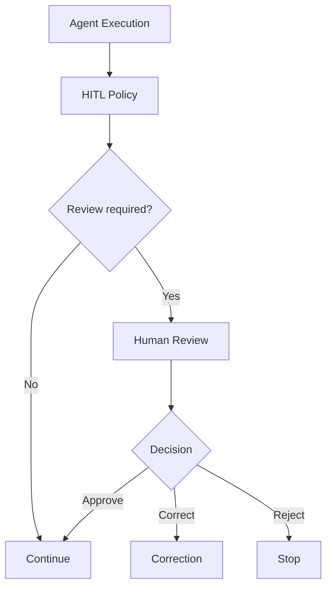

---

# 🔌 MCP e A2A

## MCP

A integração MCP é utilizada como camada de interoperabilidade entre agentes e ferramentas.

O módulo contempla conceitos como:

- manifesto de ferramentas;
- exposição controlada;
- segurança;
- auditoria;
- contratos.

## A2A

A camada A2A contém contratos voltados à comunicação **Agent-to-Agent**.

Esses componentes ajudam a separar a lógica interna dos agentes dos mecanismos utilizados para integração e comunicação.

---

# 📊 Observabilidade

Sistemas de IA precisam permitir investigação sobre o que ocorreu durante uma execução.

O projeto utiliza componentes relacionados a:

- OpenTelemetry;
- Phoenix;
- tracing;
- eventos;
- métricas;
- telemetria de LLM;
- acompanhamento de execução.

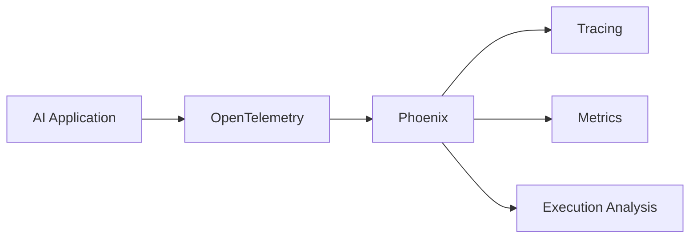

---

# 🛡️ Resiliência

Além de conceitos específicos de IA, o projeto aplica padrões de Engenharia de Software ao runtime.

| Componente | Objetivo |
|---|---|
| Circuit Breaker | reduzir chamadas repetidas a serviços indisponíveis |
| Retry | repetir operações transitórias |
| Exponential Backoff | controlar o intervalo entre tentativas |
| Deadline | limitar duração de operações |
| Failure Classification | classificar falhas |
| Fallback | disponibilizar caminhos alternativos |
| Tracing | registrar eventos de execução |

---

# 🧪 Avaliação de sistemas de IA

A camada `evaluation` possui componentes voltados à avaliação de aplicações baseadas em RAG e LLMs.

Entre os conceitos representados estão:

- Context Relevance;
- Groundedness;
- Answer Relevance;
- RAG Triad;
- DeepEval;
- qualidade da resposta;
- bridges opcionais para frameworks adicionais.

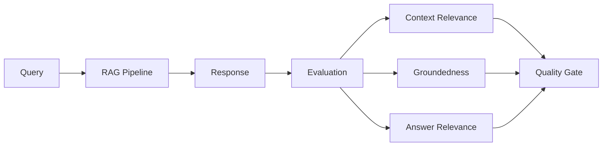

---

# ✅ Quality Gates

Os Quality Gates ajudam a separar etapas de:

**implementação → teste → avaliação → validação**

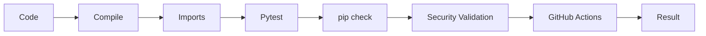

---

# ⚙️ CI/CD com GitHub Actions

O pipeline de CI é executado em:

- pushes na branch `main`;
- pull requests direcionados para `main`.

Fluxo:

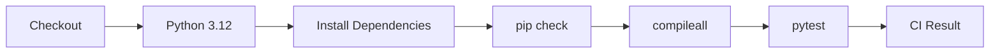

Status:

[](https://github.com/Rogerio5/INNA-AI-Engineering-Portfolio/actions/workflows/ci.yml)

---

# 🛠️ Stack tecnológica

| Categoria | Tecnologias / conceitos |
|---|---|
| Linguagem | Python |
| LLM | Google Gemini / Google GenAI |
| Orquestração | LangGraph |
| Agentic RAG | LangGraph + LlamaIndex |
| Retrieval | Hybrid Search, Fusion e Reranking |
| Knowledge Graph | Neo4j |
| Persistência | PostgreSQL |
| Schemas | Pydantic |
| Comunicação | MCP / A2A |
| Observabilidade | OpenTelemetry, Phoenix |
| Avaliação | DeepEval, RAG Triad |
| Testes | Pytest |
| CI/CD | GitHub Actions |

---

# 📁 Estrutura do projeto

```text
src/inna_ai/
├── agents/
│   ├── registry/
│   ├── routing/
│   └── supervision/
│
├── context/
│
├── demo/
│   └── financial_education/
│
├── evaluation/
│
├── governance/
│   ├── blackboard/
│   └── hitl/
│
├── integrations/
│   ├── a2a/
│   └── mcp/
│
├── llm/
│
├── memory/
│
├── observability/
│
├── orchestration/
│
├── persistence/
│
├── resilience/
│
├── retrieval/
│   ├── agentic/
│   ├── embeddings/
│   ├── graph/
│   ├── hybrid/
│   └── storage/
│
└── tools/
```

---

# 🔐 Fronteira pública

Este repositório foi separado deliberadamente da lógica de produto e das áreas comerciais privadas.

| Incluído no portfólio | Não incluído |
|---|---|
| Arquitetura de IA | Dados reais de clientes |
| LangGraph | Billing |
| Multiagentes | Planos comerciais |
| Agentic RAG | Assinaturas |
| Hybrid RAG | Administração de clientes |
| GraphRAG | Credenciais privadas |
| HITL | Integrações comerciais privadas |
| Tool Calling | Regras proprietárias completas |
| Observabilidade | Backend comercial da Sabino.AI |
| Avaliação | Dados internos |
| Adapters demonstrativos | Infraestrutura privada |

Documentação relacionada:

- [Arquitetura](docs/ARCHITECTURE.md)
- [Public Boundary](docs/PUBLIC_BOUNDARY.md)
- [Security](SECURITY.md)

---

# 🎓 Bootcamp 2026 — Engenharia de IA aplicada na prática

O **INNA AI Engineering Portfolio** também documenta a aplicação prática dos conteúdos estudados no **Bootcamp 2026 — Engenharia de IA**.

A intenção não é apenas registrar tecnologias estudadas.

A trilha procura demonstrar como os conceitos foram progressivamente transformados em:

> **conteúdo estudado → arquitetura → implementação → código → testes → avaliação → evidência técnica**

---

## 🗂️ Visão geral das semanas

| Semana | Tema | Evolução representada |
|---|---|---|
| **Semana 1** | Agentes e fundamentos | LangGraph, Tool Use, Context Engineering, Structured Outputs e Gemini |
| **Semana 2** | Multiagentes e produção | Supervisor, Routing, Handoffs, Checkpoints, HITL e Observabilidade |
| **Semana 3** | RAG e Retrieval Avançado | Hybrid RAG, Fusion/RRF, Reranking, GraphRAG e Neo4j |
| **Semana 4** | Agentic RAG e avaliação | Planner, Research Agent, Tool Calling, LlamaIndex, DeepEval e Quality Gates |

---

# 🤖 Semana 1 — Agentes e fundamentos

A primeira etapa concentra-se nos fundamentos necessários para a construção de agentes de IA.

## 📚 Conteúdos estudados

- fundamentos de agentes;
- observação, raciocínio e execução;
- uso de ferramentas;
- Context Engineering;
- Structured Outputs;
- SmolAgents;
- LlamaIndex;
- LangGraph;
- integração com modelos de linguagem.

## 🚀 Aplicação representada no portfólio

- núcleo de agentes;
- LangGraph;
- Agent Registry;
- agentes especializados;
- routing;
- estado estruturado;
- Tool Calling;
- contratos;
- Context Engineering;
- Google Gemini.

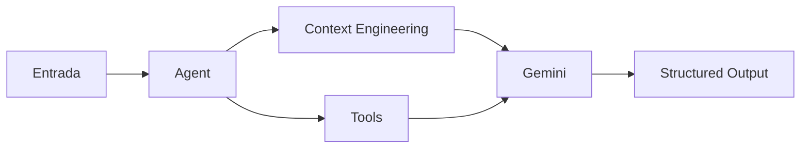

## 🏷️ Tecnologias e conceitos

| Tecnologia / conceito | Papel nesta etapa |
|---|---|
| LangGraph | orquestração de agentes |
| Context Engineering | construção e seleção de contexto |
| Tool Use | utilização de ferramentas |
| Structured Outputs | respostas estruturadas |
| Gemini | modelo de linguagem |
| SmolAgents | conteúdo estudado |
| LlamaIndex | fundamentos estudados e posteriormente aprofundados |

## 📚 Evidências

- [Semana 1 — README](docs/bootcamp-2026/semana-01/README.md)
- [Evidências da Semana 1](docs/bootcamp-2026/semana-01/evidencias/README.md)

---

# 🧠 Semana 2 — Multiagentes e produção

A segunda etapa evolui do agente individual para **sistemas compostos por múltiplos agentes especializados**.

## 📚 Conteúdos estudados

- LangGraph;
- State Machines;
- Multi-Agent Systems;
- supervisão;
- routing;
- handoffs;
- persistência de estado;
- checkpoints;
- Human-in-the-Loop;
- avaliação de agentes;
- tracing;
- observabilidade;
- Phoenix;
- DeepEval.

## 🚀 Aplicação representada no portfólio

- Supervisor;
- arquitetura multiagente;
- Agent Registry;
- Team Routing;
- agentes especializados;
- Handoff Coordinator;
- contratos de handoff;
- persistência;
- checkpoints;
- memória;
- HITL;
- OpenTelemetry;
- Phoenix.

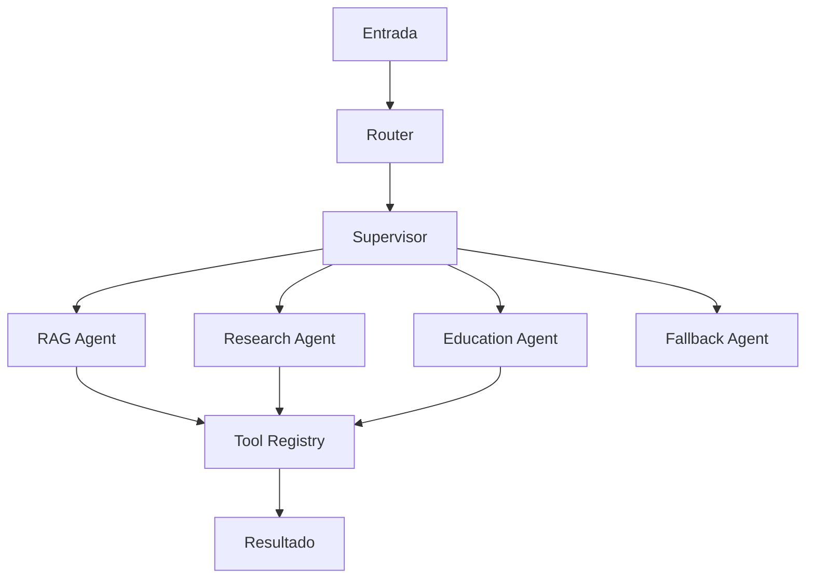

## 🔄 Handoff entre agentes

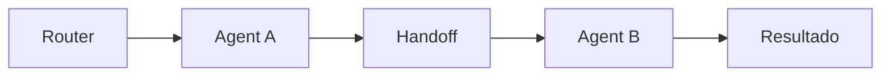

## 👤 HITL

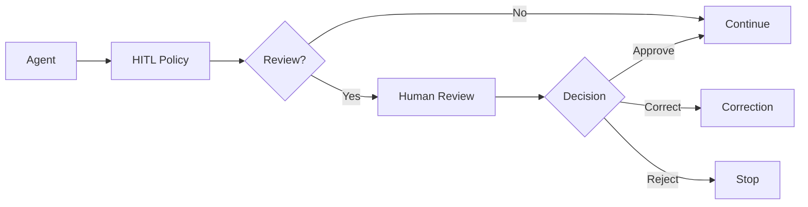

## 📚 Evidências

- [Semana 2 — README](docs/bootcamp-2026/semana-02/README.md)
- [Evidências da Semana 2](docs/bootcamp-2026/semana-02/evidencias/README.md)

---

# 🔎 Semana 3 — RAG, Retrieval Avançado e GraphRAG

A terceira etapa concentra-se em **qualidade de recuperação e construção de contexto**.

O foco deixa de ser simplesmente encontrar documentos e passa a incluir:

- relevância;
- combinação de estratégias;
- redução de contexto desnecessário;
- relacionamento entre informações;
- avaliação do retrieval.

## 📚 Conteúdos estudados

- RAG;
- chunking;
- embeddings;
- Text Retrieval;
- Vector Retrieval;
- Hybrid Retrieval;
- Reciprocal Rank Fusion — RRF;
- reranking;
- grounding;
- Sentence Window Retrieval;
- Auto-Merging Retrieval;
- RAG Triad;
- DeepEval;
- Knowledge Graph;
- Neo4j;
- Cypher;
- Graph Retrieval;
- GraphRAG;
- Quality Gates.

## 🚀 Aplicação representada no portfólio

```text
Consulta
   ↓
Text Retrieval + Vector Retrieval
   ↓
Fusion
   ↓
Reranking
   ↓
Grounding / Relevance
   ↓
Context Engineering
   ↓
LLM
   ↓
Evaluation
```

## 🔎 Hybrid Retrieval

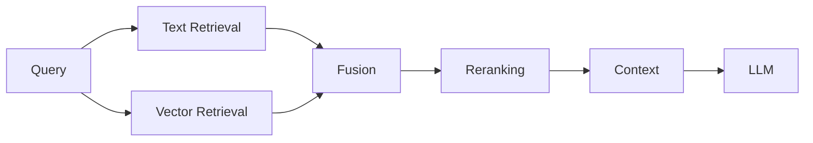

## 🕸️ Graph Retrieval

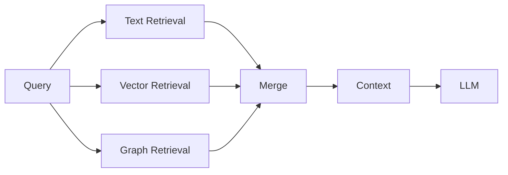

## 📚 Evidências

- [Semana 3 — README](docs/bootcamp-2026/semana-03/README.md)
- [Fundamentos de RAG](docs/bootcamp-2026/semana-03/evidencias/01-fundamentos-rag.md)
- [Chunking, Embeddings e Hybrid Search](docs/bootcamp-2026/semana-03/evidencias/02-chunking-embeddings-hybrid-search.md)
- [RRF, Reranking e Grounding](docs/bootcamp-2026/semana-03/evidencias/03-rrf-reranking-grounding.md)
- [Sentence Window Retrieval](docs/bootcamp-2026/semana-03/evidencias/04-sentence-window-retrieval.md)
- [Auto-Merging Retrieval](docs/bootcamp-2026/semana-03/evidencias/05-auto-merging-retrieval.md)
- [RAG Triad e DeepEval](docs/bootcamp-2026/semana-03/evidencias/06-rag-triad-e-deepeval.md)
- [Knowledge Graphs e GraphRAG](docs/bootcamp-2026/semana-03/evidencias/07-knowledge-graphs-e-graphrag.md)

---

# 🧭 Semana 4 — Agentic RAG e avaliação

A quarta etapa conecta:

**agentes + ferramentas + retrieval + RAG + avaliação**

O RAG deixa de representar somente uma sequência fixa de recuperação e passa a participar de fluxos nos quais agentes podem planejar, pesquisar, selecionar ferramentas, verificar evidências e sintetizar resultados.

## 📚 Conteúdos estudados

- Agentic RAG;
- Router Agents;
- Research Agents;
- Tool Calling;
- pesquisa multi-documento;
- integração RAG + agentes;
- LlamaIndex AgentWorkflow;
- RAG Triad;
- RAGAS;
- DeepEval;
- TruLens;
- Quality Gates;
- avaliação automatizada;
- CI/CD aplicado à avaliação.

## 🚀 Aplicação representada no portfólio

- Planner;
- Router;
- Research Agent;
- Collector;
- Sufficiency Check;
- Synthesizer;
- LangGraph;
- LlamaIndex;
- Tool Calling;
- Agentic RAG;
- GraphRAG;
- recuperação de evidências;
- RAG Triad;
- DeepEval;
- Quality Gates.

## 🔎 Fluxo Agentic RAG

```mermaid
flowchart LR

    QUERY[Query]

    QUERY --> PLAN[Planner]

    PLAN --> ROUTER[Router]

    ROUTER --> RESEARCH[Research Agent]

    RESEARCH --> TOOLS[Tools]

    TOOLS --> RETRIEVAL[Retrieval]

    RETRIEVAL --> COLLECT[Collector]

    COLLECT --> CHECK{Enough context?}

    CHECK -->|No| RESEARCH

    CHECK -->|Yes| SYNTH[Synthesizer]

    SYNTH --> ANSWER[Answer]
```

## 🧪 Avaliação

```mermaid
flowchart LR

    QUERY[Query]

    QUERY --> PIPELINE[RAG / Agentic Pipeline]

    PIPELINE --> RESPONSE[Response]

    RESPONSE --> EVAL[Evaluation]

    EVAL --> CONTEXT[Context Relevance]
    EVAL --> GROUND[Groundedness]
    EVAL --> ANSWER[Answer Relevance]

    CONTEXT --> GATE[Quality Gate]
    GROUND --> GATE
    ANSWER --> GATE
```

## 📚 Evidências

- [Semana 4 — README](docs/bootcamp-2026/semana-04/README.md)
- [Agentic RAG](docs/bootcamp-2026/semana-04/evidencias/01-agentic-rag.md)
- [Router Agents e Tool Calling](docs/bootcamp-2026/semana-04/evidencias/02-router-agents-e-tool-calling.md)
- [Pesquisa Multi-documento](docs/bootcamp-2026/semana-04/evidencias/03-pesquisa-multidocumento.md)
- [RAG Triad](docs/bootcamp-2026/semana-04/evidencias/04-rag-triad.md)
- [RAGAS](docs/bootcamp-2026/semana-04/evidencias/05-ragas.md)
- [DeepEval e Quality Gates](docs/bootcamp-2026/semana-04/evidencias/06-deepeval-quality-gates.md)
- [TruLens e Observabilidade](docs/bootcamp-2026/semana-04/evidencias/07-trulens-e-observabilidade.md)
- [CI/CD e Avaliação](docs/bootcamp-2026/semana-04/evidencias/08-ci-cd-e-avaliacao.md)
- [Aplicação na INNA](docs/bootcamp-2026/semana-04/evidencias/09-aplicacao-na-inna.md)
- [LlamaIndex e otimização](docs/bootcamp-2026/semana-04/evidencias/10-llamaindex-producao-e-otimizacao.md)

---

# 🏷️ Classificação das evidências

Para diferenciar aprendizado, experimentação e implementação, a documentação utiliza esta classificação:

| Classificação | Significado |
|---|---|
| 📚 **Estudado** | conteúdo analisado durante a formação |
| 🧪 **Experimentado** | laboratório, prova de conceito ou experimento |
| ✅ **Aplicado** | existe implementação correspondente |
| 🚀 **Validado** | implementação acompanhada por testes, avaliação ou Quality Gates |
| ⏳ **Roadmap** | conceito ainda não incorporado ao runtime |

Essa distinção evita apresentar uma tecnologia apenas estudada como se estivesse necessariamente implementada no projeto.

---

# 🧩 Visão consolidada — Semanas 1 a 4

As quatro etapas representam uma evolução progressiva.

| Semana | Foco | Evolução |
|---|---|---|
| **Semana 1** | Agentes | LangGraph, Tool Use, Context Engineering e Gemini |
| **Semana 2** | Multiagentes | Supervisor, Routing, Handoffs, HITL e Observabilidade |
| **Semana 3** | Retrieval | Hybrid RAG, Fusion, Reranking, GraphRAG e Neo4j |
| **Semana 4** | Agentic AI | Planner, Research Agent, Tool Calling, LlamaIndex e Evaluation |

```mermaid
flowchart LR

    W1[Semana 1<br/>Agents]

    W2[Semana 2<br/>Multi-Agent]

    W3[Semana 3<br/>Advanced RAG]

    W4[Semana 4<br/>Agentic RAG]

    PORT[AI Engineering Portfolio]

    W1 --> W2
    W2 --> W3
    W3 --> W4
    W4 --> PORT
```

## Evolução técnica

```text
SEMANA 1
Agents
+ LangGraph
+ Tool Use
+ Context Engineering
+ Gemini

        ↓

SEMANA 2
Multi-Agent
+ Supervisor
+ Handoffs
+ HITL
+ Checkpoints
+ Observability

        ↓

SEMANA 3
Hybrid RAG
+ Text Retrieval
+ Vector Retrieval
+ Fusion
+ Reranking
+ GraphRAG
+ Neo4j

        ↓

SEMANA 4
Agentic RAG
+ Planner
+ Research Agent
+ Tool Calling
+ LlamaIndex
+ Evaluation
+ Quality Gates

        ↓

INNA AI ENGINEERING PORTFOLIO
```

---

# 🔬 Trilha de evidências

A documentação do Bootcamp funciona como uma camada de rastreabilidade entre **aprendizado e implementação técnica**.

```mermaid
flowchart TD

    BOOT[Bootcamp]

    BOOT --> WEEK[Semana]

    WEEK --> CONCEPT[Conceito]

    CONCEPT --> ARCH[Arquitetura]

    ARCH --> CODE[Implementação]

    CODE --> SRC[src/inna_ai]

    SRC --> TESTS[tests]

    TESTS --> EVAL[Evaluation]

    EVAL --> GATE[Quality Gates]

    GATE --> CI[GitHub Actions]

    CI --> EVIDENCE[Evidência técnica]
```

Documentação:

- [Bootcamp 2026](docs/bootcamp-2026/README.md)
- [Semana 1](docs/bootcamp-2026/semana-01/README.md)
- [Semana 2](docs/bootcamp-2026/semana-02/README.md)
- [Semana 3](docs/bootcamp-2026/semana-03/README.md)
- [Semana 4](docs/bootcamp-2026/semana-04/README.md)

> **Semana 5:** não é apresentada como etapa implementada neste portfólio enquanto o conteúdo não estiver consolidado e validado.

---

# 🔗 Origem e evolução — INNA → AI Engineering Portfolio

O **INNA AI Engineering Portfolio** foi estruturado a partir de componentes e experiências de Engenharia de IA desenvolvidos durante a evolução da **INNA Financial Coach AI**.

A INNA permitiu aplicar esses componentes em um domínio específico.

Com o crescimento da arquitetura, tornou-se útil separar duas responsabilidades:

**aplicação de IA no domínio financeiro**  
e  
**arquitetura reutilizável de Engenharia de IA**.

```mermaid
flowchart TD

    INNA[INNA Financial Coach AI]

    INNA --> PRODUCT[Aplicação financeira]
    INNA --> ENGINEERING[AI Engineering]

    ENGINEERING --> AGENTS[Agents]
    ENGINEERING --> LANG[LangGraph]
    ENGINEERING --> RAG[RAG]
    ENGINEERING --> MEMORY[Memory]
    ENGINEERING --> TOOLS[Tool Calling]
    ENGINEERING --> HITL[HITL]

    AGENTS --> CORE[AI Engineering Core]
    LANG --> CORE
    RAG --> CORE
    MEMORY --> CORE
    TOOLS --> CORE
    HITL --> CORE

    CORE --> AGENTIC[Agentic RAG]
    CORE --> GRAPH[GraphRAG]
    CORE --> CONTEXT[Context Engineering]
    CORE --> EVAL[Evaluation]
    CORE --> OBS[Observability]
    CORE --> RES[Resilience]

    AGENTIC --> PORT[INNA AI Engineering Portfolio]
    GRAPH --> PORT
    CONTEXT --> PORT
    EVAL --> PORT
    OBS --> PORT
    RES --> PORT
```

---

# 🧩 Dois projetos, responsabilidades diferentes

| Área | INNA Financial Coach AI | INNA AI Engineering Portfolio |
|---|---|---|
| Objetivo | aplicação de IA em educação financeira | portfólio de Engenharia de IA |
| Domínio | financeiro | demonstrativo |
| LangGraph | aplicado à plataforma | camada de orquestração |
| Multiagentes | agentes da solução | arquitetura modular |
| RAG | conhecimento financeiro | Hybrid, Agentic e GraphRAG |
| Context Engineering | aplicado às interações | camada própria |
| Memória | histórico/contexto da aplicação | Memory, Summaries e Checkpoints |
| Tool Calling | ferramentas da aplicação | Tool Registry e contratos |
| HITL | revisão de fluxos | governança |
| Avaliação | avaliação da solução | Evaluation e Quality Gates |
| Observabilidade | runtime da aplicação | OpenTelemetry e Phoenix |
| Lógica comercial | ligada ao produto | não incluída |
| Dados reais | não fazem parte do portfólio | não incluídos |

---

# 🔄 Bootcamp + INNA + AI Engineering Portfolio

Os três elementos representam partes diferentes da mesma trajetória técnica.

```mermaid
flowchart TD

    BOOT[Bootcamp 2026]

    BOOT --> W1[Semana 1<br/>Agents]

    W1 --> W2[Semana 2<br/>Multi-Agent]

    W2 --> W3[Semana 3<br/>RAG]

    W3 --> W4[Semana 4<br/>Agentic RAG]

    W4 --> KNOWLEDGE[Conhecimento aplicado]

    KNOWLEDGE --> INNA[INNA Financial Coach AI]

    INNA --> EXPERIENCE[Experiência de arquitetura]

    EXPERIENCE --> SEPARATION[Separação produto / engenharia]

    SEPARATION --> PORT[INNA AI Engineering Portfolio]
```

## Como interpretar

| Elemento | Papel |
|---|---|
| **Bootcamp 2026** | organiza a evolução do conhecimento |
| **INNA Financial Coach AI** | demonstra aplicação em um domínio |
| **INNA AI Engineering Portfolio** | demonstra arquitetura e práticas de Engenharia de IA |

> **Bootcamp 2026** mostra **como o conhecimento foi desenvolvido**.  
>
> **INNA Financial Coach AI** mostra **onde a IA foi aplicada**.  
>
> **INNA AI Engineering Portfolio** mostra **como a arquitetura de IA é estruturada**.

Projeto relacionado:

➡️ **[INNA Financial Coach AI](https://github.com/Rogerio5/INNA-Financial-Coach-AI)**

---

# 📦 Instalação

## Windows / PowerShell

Crie o ambiente:

```powershell
py -3.12 -m venv .venv
```

Ative:

```powershell
.\.venv\Scripts\Activate.ps1
```

Atualize o pip:

```powershell
python -m pip install --upgrade pip
```

Instale as dependências:

```powershell
python -m pip install -r requirements/runtime.txt
python -m pip install -r requirements/dev.txt
```

Instale o projeto:

```powershell
python -m pip install -e .
```

---

# 🔑 Configuração

Crie o arquivo local:

```powershell
Copy-Item .env.example .env
```

> Nunca publique o arquivo `.env`.

Credenciais externas devem ser fornecidas através de variáveis de ambiente.

---

# 🧪 Testes

Execute:

```powershell
python -m pytest tests -q
```

A suíte estrutural foi projetada para não exigir serviços externos reais durante sua execução offline, como:

- Gemini;
- PostgreSQL remoto;
- Neo4j remoto;
- Phoenix remoto.

---

# 📚 Documentação

A pasta `docs/` contém materiais relacionados a:

- arquitetura;
- LangGraph;
- multiagentes;
- Context Engineering;
- Hybrid RAG;
- Agentic RAG;
- GraphRAG;
- Tool Calling;
- HITL;
- LlamaIndex;
- avaliação;
- observabilidade;
- Quality Gates;
- Bootcamp 2026.

Principais documentos:

- [Architecture](docs/ARCHITECTURE.md)
- [Public Boundary](docs/PUBLIC_BOUNDARY.md)
- [Security](SECURITY.md)
- [Bootcamp 2026](docs/bootcamp-2026/README.md)

---

# 🔒 Segurança

Boas práticas representadas no projeto incluem:

- variáveis de ambiente;
- `.env` ignorado pelo Git;
- `.env.example`;
- filtros de privacidade;
- separação entre portfólio e produto;
- permissões explícitas de ferramentas;
- Human-in-the-Loop;
- validações antes da publicação;
- Quality Gates;
- CI automatizado.

Consulte:

[SECURITY.md](SECURITY.md)

---

# 📜 Uso do código

Este repositório é disponibilizado publicamente como **portfólio técnico e material para avaliação profissional**.

Ele **não é distribuído sob uma licença open source**.

A ausência de uma licença explícita significa que este repositório não concede automaticamente autorização ampla para reutilização, redistribuição ou incorporação substancial do código em outros projetos.

---

# 💰 Aviso financeiro

Os componentes relacionados ao domínio financeiro existem exclusivamente como **cenário educacional e demonstrativo de Engenharia de IA**.

Eles não constituem:

- recomendação financeira;
- recomendação de crédito;
- recomendação de investimento.

---

# 👨‍💻 Autor

## Rogério Augusto Sabino

**Engenharia de IA & Dados**

GenAI • RAG • LLMs • Agentic AI • Python • Machine Learning • MLOps

GitHub:

[github.com/Rogerio5](https://github.com/Rogerio5)

---

# ⭐ Sobre este projeto

Este repositório representa uma consolidação prática de estudos e desenvolvimento em **Engenharia de Inteligência Artificial**.

As áreas representadas incluem:

**Software Engineering • Generative AI • Agentic AI • Multi-Agent Systems • RAG • LLM Applications • Context Engineering • AI Governance • Evaluation • Observability • MLOps**

O objetivo não é demonstrar apenas o consumo de uma API de LLM.

O foco está na construção de **sistemas de Inteligência Artificial estruturados, modulares, governáveis, testáveis, observáveis e resilientes**.
