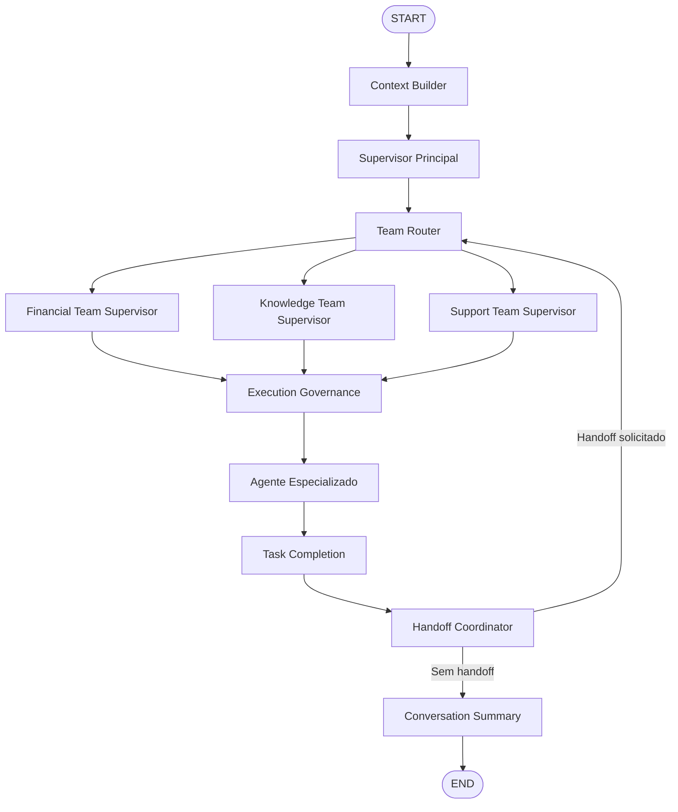

# Arquitetura Hierárquica de Equipes de Agentes da INNA

## 1. Visão geral

A INNA utiliza uma arquitetura multiagente hierárquica baseada em LangGraph. O supervisor principal classifica a solicitação, o Team Router identifica a equipe responsável, o supervisor local autoriza o agente e a Execution Governance valida a execução.

```text
START
→ context_builder
→ supervisor
→ team_router
→ supervisor de equipe
→ execution_governance
→ agente especializado
→ task_completion
→ handoff_coordinator
→ conversation_summary
→ END
```

Handoffs solicitados retornam à hierarquia:

```text
handoff_coordinator
→ team_router
→ supervisor da equipe de destino
→ execution_governance
→ agente de destino
```

---

## 2. Objetivos

A arquitetura foi criada para:

1. organizar os agentes em equipes;
2. separar supervisão global e local;
3. impedir execução fora da equipe;
4. preservar a governança antes de cada agente;
5. impedir handoffs diretos entre agentes;
6. controlar transferências entre equipes;
7. registrar decisões e rastreamento;
8. limitar retornos ao supervisor principal;
9. preservar Task Completion e Conversation Summary;
10. preparar o núcleo para Human-in-the-Loop.

---

## 3. Equipes registradas

```text
financial_team
├── financial_agent
└── report_agent

knowledge_team
├── education_agent
└── rag_agent

support_team
└── fallback_agent
```

Cada agente pertence a exatamente uma equipe.

---

## 4. Financial Team

Supervisor:

```text
financial_team_supervisor
```

Responsabilidades:

- diagnóstico financeiro;
- cálculos e interpretação de renda e gastos;
- análise de dívidas;
- histórico financeiro;
- geração de relatórios.

Limite interno:

```text
max_internal_handoffs = 2
```

---

## 5. Knowledge Team

Supervisor:

```text
knowledge_team_supervisor
```

Responsabilidades:

- educação financeira;
- explicações conceituais;
- consultas baseadas em RAG;
- recuperação de conhecimento.

Limite interno:

```text
max_internal_handoffs = 2
```

---

## 6. Support Team

Supervisor:

```text
support_team_supervisor
```

Responsabilidades:

- recuperação segura;
- rotas desconhecidas;
- solicitações não classificadas;
- fallback operacional.

Limite interno:

```text
max_internal_handoffs = 1
```

---

## 7. Registro formal

Arquivo:

```text
src/agents/team_hierarchy.py
```

Contratos principais:

```text
TeamDefinition
TeamTransferDecision
TeamRegistry
DEFAULT_TEAM_REGISTRY
```

Validações:

- nomes de equipes únicos;
- supervisores únicos;
- membros obrigatórios;
- ausência de membros duplicados;
- ausência de agentes em múltiplas equipes;
- limite interno positivo.

---

## 8. Team Router

Arquivo:

```text
src/agents/team_router.py
```

Responsabilidades:

- receber a rota do supervisor principal;
- identificar o agente solicitado;
- resolver a equipe;
- selecionar o supervisor local;
- priorizar destinos de handoff;
- recuperar rotas inválidas;
- registrar decisão e trace.

Prioridade:

```text
1. destino de handoff solicitado
2. team_requested_agent
3. next_node
4. fallback_agent
```

---

## 9. Supervisores de equipe

Arquivo:

```text
src/agents/team_supervisor.py
```

Nós:

```text
financial_team_supervisor_node
knowledge_team_supervisor_node
support_team_supervisor_node
```

Registro central:

```text
TEAM_SUPERVISOR_NODES
```

Responsabilidades:

- validar a associação do agente;
- autorizar rotas internas;
- inferir agente pela intenção;
- escalar transferências entre equipes;
- registrar histórico e trace;
- atualizar visitas ao supervisor principal.

---

## 10. Regras de roteamento

```text
diagnostico_financeiro → financial_agent
historico_financeiro   → financial_agent
relatorio              → report_agent
consulta_rag           → rag_agent
educacao_financeira    → education_agent
desconhecido           → fallback_agent
```

Na solicitação composta de diagnóstico e relatório, o fluxo inicia no `financial_agent` e cria um handoff para o `report_agent` após a conclusão do diagnóstico.

---

## 11. Topologia LangGraph



A topologia possui 15 nós, 10 arestas estáticas e 6 fontes de branches condicionais.

---

## 12. Estado hierárquico

Campos adicionados ao `InnaAgentState`:

```text
hierarchical_routing_enabled
current_team
team_supervisor
team_route
team_requested_agent
team_route_source
team_routing_reason
team_requires_root_supervisor
team_route_history
root_supervisor_visits
max_root_supervisor_visits
```

Valores iniciais:

```text
hierarchical_routing_enabled = true
current_team = ""
team_supervisor = ""
team_route = ""
team_requested_agent = ""
team_route_history = []
root_supervisor_visits = 0
max_root_supervisor_visits = 3
```

---

## 13. Transferências entre equipes

Transferência interna:

```text
financial_agent → report_agent
allowed = true
same_team = true
requires_root_supervisor = false
```

Transferência externa:

```text
financial_agent → rag_agent
allowed = false
same_team = false
requires_root_supervisor = true
```

Transferências entre equipes retornam ao supervisor principal.

---

## 14. Proteção contra loops

Enquanto:

```text
root_supervisor_visits < max_root_supervisor_visits
```

o fluxo pode retornar ao supervisor principal.

Quando:

```text
root_supervisor_visits >= max_root_supervisor_visits
```

a rota segue para:

```text
fallback_agent
```

O limite padrão é 3.

---

## 15. Handoff Financial para Report

Fluxo validado:

```text
financial_agent
→ task_completion
→ handoff_coordinator
→ team_router
→ financial_team_supervisor
→ execution_governance
→ report_agent
→ task_completion
→ handoff_coordinator
→ conversation_summary
→ END
```

O Handoff Coordinator não executa diretamente o agente de destino.

---

## 16. Observabilidade

Eventos do Team Router:

```text
team_router:financial_team:financial_team_supervisor:financial_agent
team_router:financial_team:financial_team_supervisor:report_agent
team_router:knowledge_team:knowledge_team_supervisor:rag_agent
team_router:support_team:support_team_supervisor:fallback_agent
```

Eventos dos supervisores:

```text
team_supervisor:financial_team:selected:financial_agent
team_supervisor:financial_team:selected:report_agent
team_supervisor:knowledge_team:selected:rag_agent
team_supervisor:support_team:selected:fallback_agent
```

Decisões estruturadas:

```text
structured_response.team_router_decision
structured_response.team_supervisor_decisions
```

---

## 17. Arquivos de produção

Criados:

```text
src/agents/team_hierarchy.py
src/agents/team_router.py
src/agents/team_supervisor.py
```

Modificados:

```text
src/agents/graph.py
src/agents/state.py
```

---

## 18. Arquivos de teste

Criados:

```text
tests/unit/test_team_hierarchy.py
tests/unit/test_team_supervisor.py
tests/unit/test_team_router.py
tests/unit/test_team_hierarchy_state.py
tests/unit/test_hierarchical_graph_integration.py
```

Modificados:

```text
tests/unit/test_handoff_graph_contract.py
tests/unit/test_financial_report_handoff_routing.py
```

---

## 19. Resultado da validação

```text
2258 passed
1 skipped
0 failed
```

Tempo registrado:

```text
40.75 segundos
```

Compilação:

```text
python -m compileall src tests -q
APROVADO
```

Estrutura:

```text
15 nós LangGraph
3 equipes
3 supervisores locais
5 agentes especializados
10 arestas estáticas
6 fontes de branches condicionais
```

Situação dos recursos:

```text
Tool Use                 CONCLUÍDO
Task Completion          CONCLUÍDO
Handoffs explícitos      CONCLUÍDOS
Times hierárquicos       CONCLUÍDOS
Human-in-the-Loop        PENDENTE
```

---

## 20. Evoluções futuras

As evoluções pertencem ao roadmap do núcleo multiagente completo:

1. Human-in-the-Loop;
2. aprovação e rejeição manual;
3. pausa e retomada persistente;
4. políticas específicas por equipe;
5. limites persistentes por usuário;
6. métricas de duração e handoffs;
7. supervisor principal baseado em políticas;
8. execução assíncrona e filas por equipe;
9. prioridade de tarefas;
10. escalonamento humano;
11. checkpoint antes de handoffs;
12. recuperação e compensação de execução;
13. painel administrativo;
14. tracing distribuído;
15. Prometheus e alertas operacionais;
16. controle de custos por equipe;
17. avaliação automática da qualidade.

A próxima evolução recomendada é o Human-in-the-Loop formal:

```text
agente especializado
→ avaliação de risco
→ condição crítica
→ execução pausada
→ confirmação, correção ou rejeição
→ atualização do estado
→ retomada por checkpoint
```

---

## 21. Conclusão

A INNA possui uma arquitetura multiagente hierárquica formal, governada e rastreável, com equipes especializadas, supervisores locais, Team Router, handoffs hierárquicos, proteção contra loops, observabilidade e compatibilidade com Task Completion, Handoff Coordinator e Conversation Summary.

A arquitetura está preparada para a implementação formal de Human-in-the-Loop.
