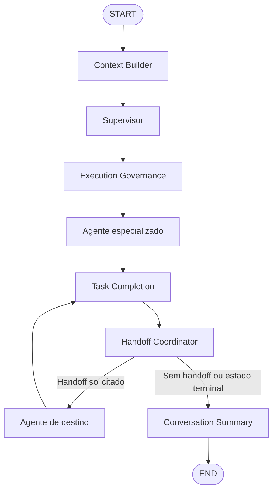
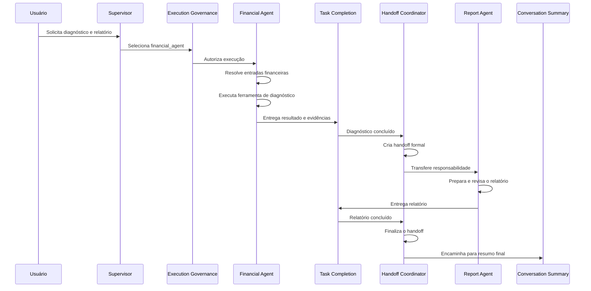
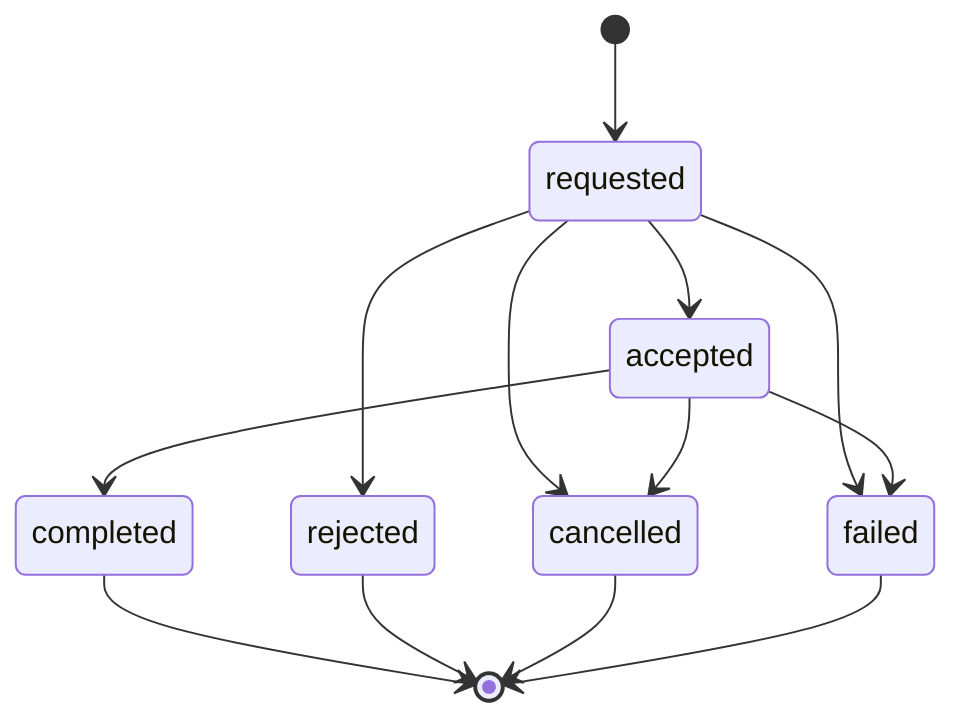

# Arquitetura de Handoffs Multiagente da INNA

## 1. Visão geral

A INNA utiliza uma arquitetura multiagente baseada em LangGraph, na qual agentes especializados cooperam para concluir tarefas financeiras mais complexas.

O mecanismo de handoff permite transferir explicitamente a responsabilidade de uma tarefa entre agentes. Essa transferência não representa apenas uma mudança de rota: ela possui um contrato formal, histórico, estado, evidências, resultado, controle de limites e rastreabilidade.

A implementação atual suporta o fluxo:

```text
financial_agent
→ task_completion
→ handoff_coordinator
→ report_agent
→ task_completion
→ handoff_coordinator
→ conversation_summary
```

Esse fluxo é utilizado principalmente quando o usuário solicita um diagnóstico financeiro seguido da geração de um relatório.

---

## 2. Objetivos da arquitetura

A arquitetura de handoffs foi implementada para:

1. Permitir transferências explícitas entre agentes.
2. Definir claramente o agente de origem e o agente de destino.
3. Registrar o motivo de cada transferência.
4. Validar se a tarefa anterior foi realmente concluída.
5. Evitar transferências duplicadas.
6. Impedir handoffs para o próprio agente.
7. Bloquear destinos não registrados.
8. Limitar a quantidade de handoffs por execução.
9. Impedir ciclos entre agentes.
10. Preservar evidências da execução.
11. Registrar o histórico das transições.
12. Integrar o processo ao LangGraph.
13. Manter compatibilidade com os módulos existentes.
14. Permitir futura implementação de Human-in-the-Loop.
15. Preparar o núcleo para equipes hierárquicas.

---

## 3. Topologia principal do LangGraph



A topologia anterior encaminhava o agente diretamente ao resumo da conversa.

A topologia atual utiliza a seguinte cadeia de finalização:

```text
agente especializado
→ task_completion
→ handoff_coordinator
→ conversation_summary
```

Quando existe um handoff solicitado, o coordenador encaminha a execução para outro agente antes do resumo final.

---

## 4. Agentes especializados

Os agentes atualmente permitidos na arquitetura são:

```text
financial_agent
education_agent
rag_agent
report_agent
fallback_agent
```

Esses agentes estão registrados em:

```text
ALLOWED_AGENT_ROUTES
```

no arquivo:

```text
src/agents/graph.py
```

O coordenador somente permite handoffs cujo destino pertença a essa lista.

---

## 5. Fluxo financeiro seguido de relatório

A principal transferência implementada é:

```text
financial_agent → report_agent
```

Esse fluxo é iniciado quando a mensagem contém uma solicitação composta.

Exemplo:

```text
Analise minha situação financeira e gere um relatório.
```

### Sequência de execução



---

## 6. Diferenciação de solicitações

### 6.1 Diagnóstico financeiro simples

Mensagem:

```text
Analise minha situação financeira.
```

Decisão esperada:

```text
intent = diagnostico_financeiro
next_node = financial_agent
generate_report = false
```

Nesse caso, o agente financeiro executa o diagnóstico, mas não solicita handoff para o agente de relatório.

### 6.2 Relatório baseado em dados existentes

Mensagem:

```text
Gere um relatório com os dados existentes.
```

Decisão esperada:

```text
intent = relatorio
next_node = report_agent
generate_report = true
```

Nesse cenário, a solicitação é encaminhada diretamente ao `report_agent`.

### 6.3 Diagnóstico seguido de relatório

Mensagem:

```text
Analise minha situação financeira e gere um relatório.
```

Decisão inicial:

```text
intent = diagnostico_financeiro
next_node = financial_agent
generate_report = true
```

Após a conclusão do diagnóstico:

```text
handoff_required = true
handoff_target = report_agent
```

---

## 7. Supervisor composto

O supervisor possui detectores determinísticos para diferenciar solicitações simples e compostas.

Principais funções:

```text
_detectar_pedido_diagnostico
_detectar_diagnostico_com_relatorio
```

O supervisor composto preserva três comportamentos:

```text
Diagnóstico simples
→ financial_agent
→ generate_report=False

Relatório simples
→ report_agent
→ generate_report=True

Diagnóstico + relatório
→ financial_agent
→ generate_report=True
→ handoff para report_agent
```

A decisão também é registrada no campo:

```text
structured_response.supervisor_decision
```

---

## 8. Contrato formal de handoff

O contrato está implementado no arquivo:

```text
src/agents/handoff.py
```

O registro formal contém os seguintes campos:

| Campo | Finalidade |
|---|---|
| `handoff_id` | Identificador único da transferência |
| `from_agent` | Agente que transfere a responsabilidade |
| `to_agent` | Agente que recebe a responsabilidade |
| `reason` | Motivo formal do handoff |
| `payload` | Evidências transferidas |
| `status` | Estado atual |
| `created_at` | Data e hora da criação |
| `updated_at` | Data e hora da última atualização |
| `accepted_at` | Data e hora do aceite |
| `completed_at` | Data e hora da conclusão |
| `result` | Resultado da execução do destino |
| `error` | Erro terminal |
| `metadata` | Metadados de auditoria |

---

## 9. Estados do handoff

Os estados formais são:

```text
requested
accepted
completed
rejected
cancelled
failed
```

### Máquina de estados



### Transições permitidas

```text
requested
├── accepted
├── rejected
├── cancelled
└── failed

accepted
├── completed
├── cancelled
└── failed
```

Uma tentativa de transição incompatível com o estado atual é rejeitada pelo contrato.

---

## 10. Handoff Coordinator

O coordenador está implementado em:

```text
src/agents/handoff_coordinator_node.py
```

Responsabilidades:

- identificar o agente atual;
- validar o agente de origem;
- validar o agente de destino;
- validar o motivo da transferência;
- criar o handoff;
- registrar o aceite;
- concluir o handoff;
- registrar falhas;
- controlar o contador;
- aplicar o limite máximo;
- bloquear self-handoff;
- bloquear ciclos reversos;
- preservar o histórico;
- registrar eventos no trace;
- selecionar a próxima rota.

---

## 11. Ciclo de execução do coordenador

O coordenador processa uma etapa por passagem.

### Criação

Quando:

```text
handoff_required = true
```

o coordenador valida:

```text
handoff_target
handoff_reason
current_agent
handoff_count
max_handoffs
handoff_history
```

Depois cria um registro com status:

```text
requested
```

### Aceite

Quando o agente de destino assume a tarefa, o handoff muda para:

```text
accepted
```

### Conclusão

Quando o agente de destino apresenta:

```text
task_status = completed
```

o handoff muda para:

```text
completed
```

### Falha

Quando existem erros na execução do destino, o handoff muda para:

```text
failed
```

---

## 12. Task Completion

A validação de conclusão está implementada em:

```text
src/agents/task_completion.py
src/agents/task_completion_node.py
```

O objetivo é impedir que uma tarefa seja considerada concluída apenas porque o agente produziu uma resposta textual.

A conclusão exige evidências objetivas.

### Evidências do Financial Agent

```text
agent_execution
financial_inputs_resolved
financial_calculation_executed
response_generation
```

### Evidências do Report Agent

```text
agent_execution
report_generation
response_generation
```

### Estados possíveis da tarefa

```text
pending
in_progress
completed
partially_completed
needs_user_input
blocked
failed
cancelled
```

---

## 13. Estado compartilhado

Os campos de handoff foram adicionados ao `InnaAgentState`.

```text
handoff_current
handoff_history
handoff_count
max_handoffs
handoff_limit_exceeded
handoff_required
handoff_target
handoff_reason
```

### Campos

| Campo | Finalidade |
|---|---|
| `handoff_current` | Handoff atual |
| `handoff_history` | Histórico lógico |
| `handoff_count` | Quantidade criada na execução |
| `max_handoffs` | Limite máximo permitido |
| `handoff_limit_exceeded` | Indicação de limite excedido |
| `handoff_required` | Pedido de transferência |
| `handoff_target` | Destino solicitado |
| `handoff_reason` | Motivo da solicitação |

O limite padrão atual é:

```text
max_handoffs = 3
```

---

## 14. Reducer do histórico

O reducer utilizado é:

```text
merge_handoff_history
```

Ele utiliza:

```text
handoff_id
```

como identificador lógico.

Quando o mesmo handoff muda de estado:

```text
requested → accepted → completed
```

o registro existente é atualizado.

Isso evita que uma única transferência seja registrada como três handoffs diferentes.

O reducer também ignora registros inválidos:

- objetos que não são dicionários;
- registros sem `handoff_id`;
- identificadores vazios;
- identificadores contendo somente espaços.

---

## 15. Governança operacional

### 15.1 Self-handoff

É proibida uma transferência para o próprio agente.

Exemplo bloqueado:

```text
financial_agent → financial_agent
```

Evento:

```text
handoff:error:self_handoff
```

### 15.2 Destino inválido

O destino precisa fazer parte de `ALLOWED_AGENT_ROUTES`.

Evento:

```text
handoff:error:invalid_target
```

### 15.3 Origem não identificada

Quando o coordenador não consegue identificar o agente de origem:

```text
handoff:error:source_unresolved
```

### 15.4 Motivo ausente

Toda transferência precisa possuir uma justificativa.

Evento:

```text
handoff:error:missing_reason
```

### 15.5 Limite máximo

Quando:

```text
handoff_count >= max_handoffs
```

uma nova transferência é bloqueada.

Evento:

```text
handoff:error:limit_exceeded
```

### 15.6 Ciclo reverso

O coordenador bloqueia ciclos como:

```text
financial_agent → report_agent
report_agent → financial_agent
```

Evento:

```text
handoff:error:reverse_cycle
```

### 15.7 Handoff duplicado

O Financial Agent não solicita um novo handoff quando já existe uma transferência ativa com status:

```text
requested
accepted
```

---

## 16. Payload mínimo

O coordenador evita copiar todo o estado da aplicação.

O payload do handoff contém somente informações necessárias:

```text
intent
task_status
task_completion_score
completed_requirements
missing_requirements
response
```

Metadados adicionais:

```text
thread_id
route_source
routing_reason
```

Essa estratégia reduz:

- acoplamento entre agentes;
- propagação desnecessária de dados;
- tamanho do estado;
- risco de exposição de informações;
- dependência da implementação interna de outro agente.

---

## 17. Integração do Financial Agent

O `financial_agent_node` solicita handoff somente depois que a ferramenta financeira retorna sucesso.

Condições principais:

```text
generate_report = true
intent = diagnostico_financeiro
handoff não está ativo
handoff_limit_exceeded = false
```

Quando todas as condições são verdadeiras:

```text
handoff_required = true
handoff_target = report_agent
```

O motivo registrado é semelhante a:

```text
O diagnóstico financeiro foi concluído com sucesso e
o usuário solicitou a geração de um relatório.
```

---

## 18. Proteção em caminhos incompletos

O Financial Agent não solicita handoff quando:

- faltam dados financeiros;
- a resolução de entrada não está pronta;
- a ferramenta de diagnóstico falha;
- não foi solicitado relatório;
- a intenção não é diagnóstico financeiro;
- existe um handoff ativo;
- o limite foi excedido;
- a execução corresponde ao histórico financeiro.

Nesses caminhos:

```text
handoff_required = false
handoff_target = ""
handoff_reason = ""
```

---

## 19. Resolver financeiro com fallback

O arquivo:

```text
src/agents/financial_input_resolver.py
```

possui um fallback determinístico para extrair dados financeiros diretamente da mensagem do usuário.

Esse fallback suporta:

- linguagem natural;
- campos separados por dois-pontos;
- valores monetários brasileiros;
- preenchimento de campos ausentes;
- correção de valores inválidos retornados pelo parser;
- preservação de valores zero explícitos.

Avisos possíveis:

```text
message_parser_recovered_by_fallback
message_parser_values_repaired_by_fallback
```

---

## 20. Observabilidade

Os eventos do handoff são registrados no campo:

```text
trace
```

Exemplos:

```text
handoff:intent:financial_agent->report_agent
handoff:requested:financial_agent->report_agent:<handoff_id>
handoff:accepted:financial_agent->report_agent:<handoff_id>
handoff:completed:<handoff_id>
handoff:failed:<handoff_id>
handoff:error:source_unresolved
handoff:error:invalid_target
handoff:error:self_handoff
handoff:error:missing_reason
handoff:error:limit_exceeded
handoff:error:reverse_cycle
```

O Financial Agent também registra em:

```text
structured_response.handoff_request
```

os campos:

```text
from_agent
to_agent
reason
trigger
diagnosis_available
report_requested
```

---

## 21. Roteamento após o coordenador

A função:

```text
_selecionar_rota_apos_handoff
```

avalia o `handoff_current`.

Quando o status é:

```text
requested
```

e o destino é válido, o fluxo segue para o agente solicitado.

Quando não existe handoff ou o status é terminal:

```text
completed
failed
rejected
cancelled
```

o fluxo segue para:

```text
conversation_summary
```

---

## 22. Arquivos de produção

Arquivos criados:

```text
src/agents/handoff.py
src/agents/handoff_coordinator_node.py
src/agents/task_completion.py
src/agents/task_completion_node.py
```

Arquivos modificados:

```text
src/agents/financial_input_resolver.py
src/agents/graph.py
src/agents/nodes.py
src/agents/state.py
src/agents/supervisor.py
```

---

## 23. Testes implementados

### Contrato do handoff

```text
tests/unit/test_handoff_contract.py
```

Valida:

- criação;
- aceite;
- conclusão;
- rejeição;
- cancelamento;
- falha;
- transições inválidas;
- timestamps;
- resultados;
- erros.

### Estado e reducer

```text
tests/unit/test_handoff_state.py
```

Valida:

- inicialização;
- união do histórico;
- atualização por ID;
- idempotência;
- registros inválidos;
- IDs vazios;
- normalização.

### Coordenador

```text
tests/unit/test_handoff_coordinator_node.py
```

Valida:

- ausência de solicitação;
- criação;
- aceite;
- conclusão;
- falha;
- destino inválido;
- self-handoff;
- motivo ausente;
- resolução da origem;
- contador;
- limite máximo;
- ciclo reverso;
- conclusão imediata.

### Topologia LangGraph

```text
tests/unit/test_handoff_graph_contract.py
tests/unit/test_langgraph_topology.py
tests/unit/test_task_completion_graph_contract.py
tests/unit/test_conversation_summary_graph_contract.py
```

Valida:

- registro do coordenador;
- rotas dos agentes;
- passagem pelo Task Completion;
- ausência de atalhos;
- roteamento condicional;
- finalização no resumo.

### Supervisor composto

```text
tests/unit/test_supervisor_composite_report_flow.py
```

Valida:

- diagnóstico simples;
- relatório simples;
- diagnóstico com relatório;
- detector composto;
- detector explícito;
- ausência de classificação excessiva;
- registro estruturado.

### Financial Agent

```text
tests/unit/test_financial_report_handoff_contract.py
tests/unit/test_financial_report_handoff_routing.py
```

Valida:

- solicitação de handoff;
- sucesso obrigatório;
- ausência de duplicação;
- preservação de evidências;
- roteamento ao relatório;
- conclusão pelo destino.

### Teste ponta a ponta

```text
tests/integration/test_financial_report_handoff_langgraph_e2e.py
```

Valida a sequência completa:

```text
context_builder
→ supervisor
→ execution_governance
→ financial_agent
→ task_completion
→ handoff_coordinator
→ report_agent
→ task_completion
→ handoff_coordinator
→ conversation_summary
→ END
```

---

## 24. Resultado da validação

A regressão completa apresentou:

```text
2156 passed
1 skipped
0 failed
```

Tempo registrado na execução final:

```text
41.49 segundos
```

Também foram aprovadas:

```text
python -m compileall src tests -q
```

e a validação dos imports de produção.

Resultado estrutural:

```text
11 nós registrados no LangGraph
5 rotas especializadas permitidas
```

---

## 25. Ferramentas de qualidade

Na auditoria atual:

```text
pytest = disponível
ruff = não instalado
black = não instalado
mypy = não instalado
```

A configuração dessas ferramentas pode ser centralizada no arquivo:

```text
pyproject.toml
```

A ausência dessas ferramentas não invalidou os testes funcionais, estruturais e de integração já executados.

---

## 26. Tratamento de fim de linha

Em ambiente Windows, o Git pode apresentar avisos relacionados a:

```text
LF will be replaced by CRLF
```

Esses avisos não representam erro de execução.

A normalização pode ser controlada por:

```text
.gitattributes
```

Arquivos Python, Markdown e configuração podem ser mantidos em LF, enquanto scripts específicos do Windows podem permanecer em CRLF.

---

## 27. Evoluções futuras

A arquitetura atual permite evoluir para:

1. equipes hierárquicas de agentes;
2. supervisor de equipes;
3. políticas por agente;
4. Human-in-the-Loop;
5. aprovação manual de handoffs;
6. rejeição manual;
7. pausa e retomada persistente;
8. checkpoints antes da transferência;
9. filas assíncronas;
10. prioridades de execução;
11. métricas de duração;
12. alertas de falha;
13. painel de observabilidade;
14. rastreamento distribuído;
15. compensação de tarefas;
16. múltiplos destinos;
17. handoffs condicionais;
18. políticas baseadas em risco;
19. escalonamento para atendimento humano;
20. auditoria administrativa.

---

## 28. Conclusão

A implementação de handoffs transforma o núcleo da INNA em uma arquitetura multiagente com transferência formal e rastreável de responsabilidade.

A solução possui:

- contrato formal;
- máquina de estados;
- histórico idempotente;
- validação da conclusão;
- coordenador determinístico;
- integração com LangGraph;
- supervisor composto;
- handoff Financial Agent para Report Agent;
- bloqueio de self-handoff;
- limite máximo;
- prevenção de ciclos;
- payload mínimo;
- observabilidade;
- cobertura unitária;
- teste ponta a ponta;
- regressão completa aprovada.

O núcleo está preparado para a próxima evolução arquitetural: equipes hierárquicas e Human-in-the-Loop.
